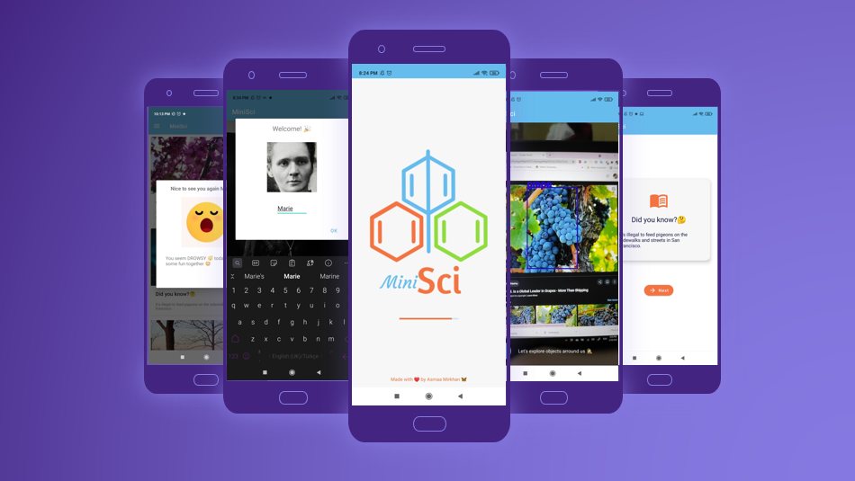

# ✨ MiniSci
- AI based mobile app that aims to improve learning experience for children 🎈
- MiniSci is a proof-of-concept for the ability of improving learning experience using AI
- Made with a lot of love 💗

## 💼 Used structures
### 💣 AI
- Face recognition: FaceNet
- Similarity criteria: Cosine distance 
- Object Detection : YOLO V4 Tiny
- Face detection: Blaze Face

### 📱 Android
- Shared preferences
- CameraX
- Firebase database
- Firebase MLKit
- Tflite interpreter
- Notifications
- Broadcast Reciever
- RecyclerView

## 👮‍♀️ Face Recognition
🎉 The purpose of this method is to make the whole experience more funny for the child

### 🧙‍♀️ Signup Process
- A face detection model (blaze face) works over every frame and returns the coordinates of every detected face.
- The child selects the best second, clicks on + button, the frame is cropped and shown on a dialog with an editText, the child writes his name and clicks on OK
- Using FaceNet a 128 length vector is created and saved as sharedPrefernces to be used in login process

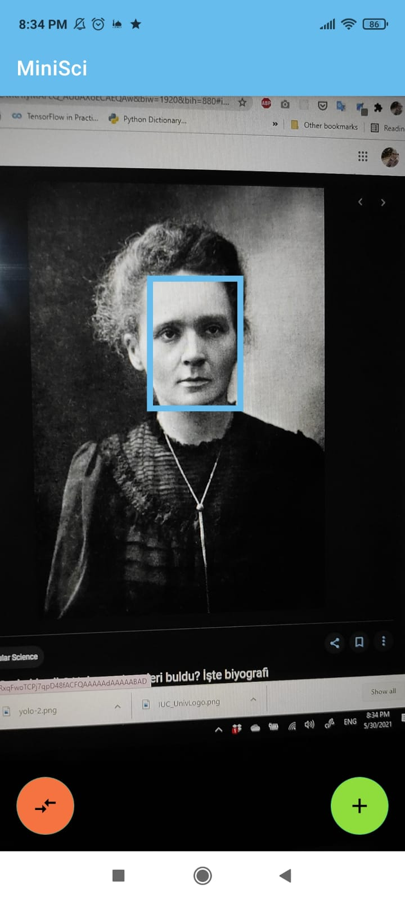
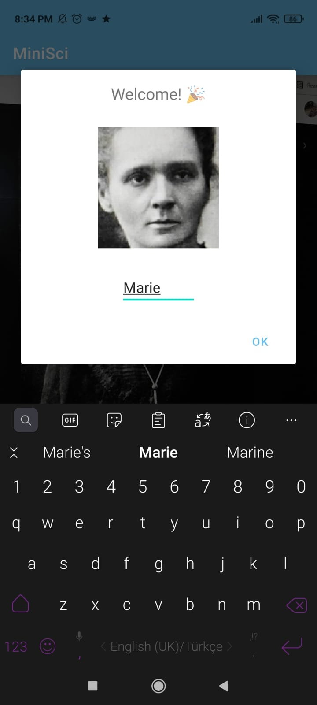
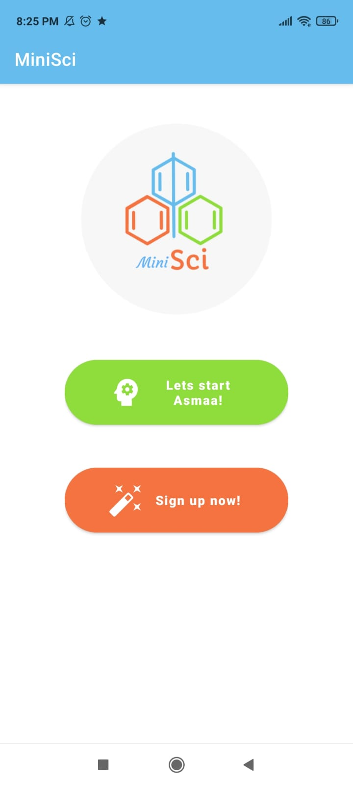

  
### 👤 Login Process
- A face detection model (Blaze face) detects faces in the frames, finds each vector corresponded to each detected face, calculates cosine distance with vector stored in sharedPrefernces, finds the registered user and pass to dashboard activity. 
- The last detected face is also used for emotion analysis using the ststus of eyes and mouth and every face is classified as `Neutral`, `Happy` or `Drowsy` and different welcome dialogs are shown correspondingly.
  

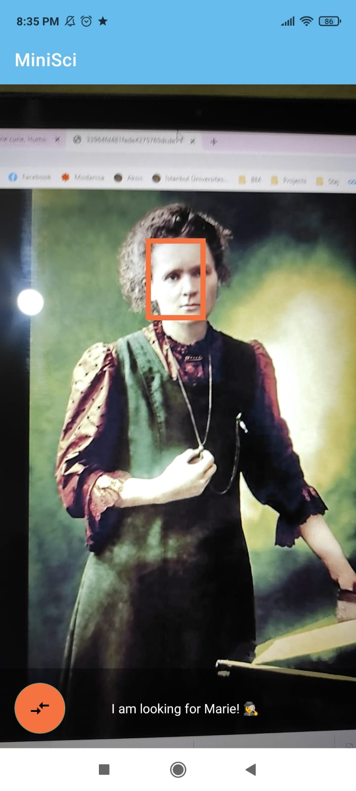
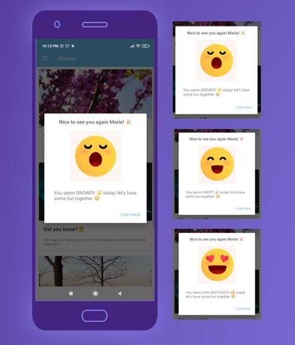

## 🌸 Dashboard Activity
Quote and Info of the day with inspirational photos 

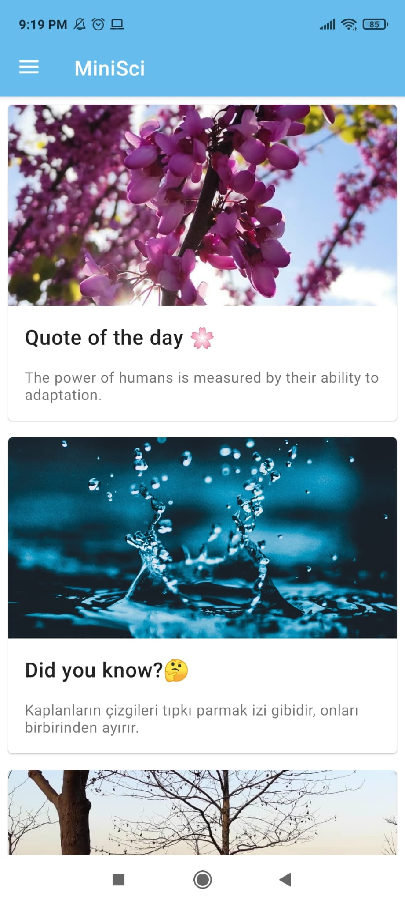

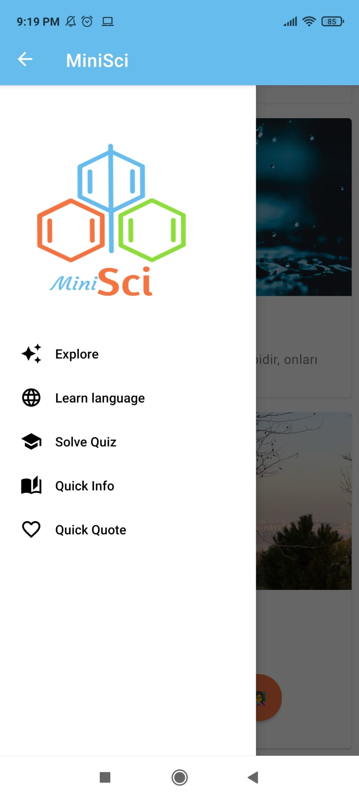

## 🕵️‍♀️ Explore Activity
- A YOLO v4 tiny model analyses the frames, finds the objects in classes it knows and returns coordinates of them
- When the child clicks on the found object all the info related to that object are fetched from Firebase and shown inside a RecyclerView 
- Classes:
  - bird, cat, dog, horse, sheep, cow, elephant, bear, giraffe, banana, apple, orange, broccoli, Carrot, chicken, fish, grape
- Dataset sources:
  - MS COCO
  - Google OpenImages

> 🤖 The model is trained specifically for this project, (instruction document is being prepared, **stay tuned 🥳**)

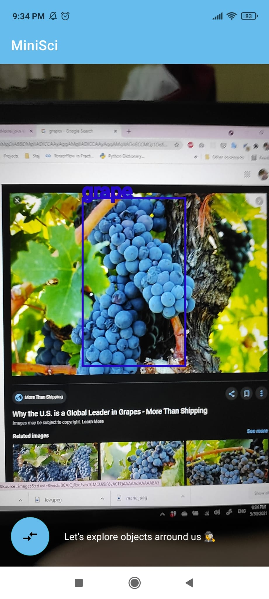

## 🤓 Learn Language Activity
- A YOLO v4 tiny model analyses the frames, finds the objects in classes it knows and returns coordinates of them
- Every detected object is shown in both English and Turkish 
- Classes:
  - COCO's 80 classes
- Dataset sources:
  - MS COCO

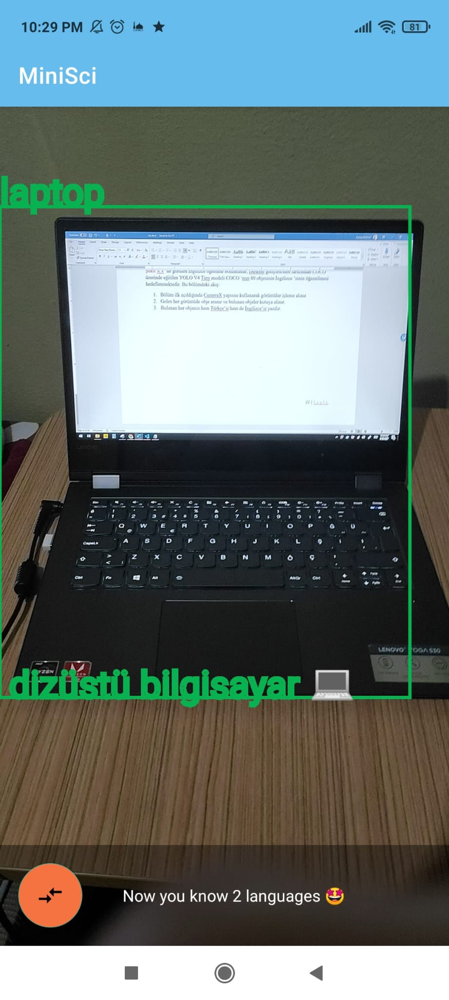

## 👩‍🏫 Solve Quiz Activity
- A quiz is feteched from Firebase and when the child clicks on option he thinks it's true the result is shown by options' colors

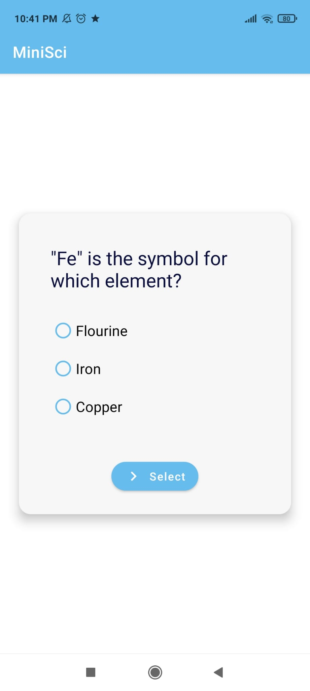
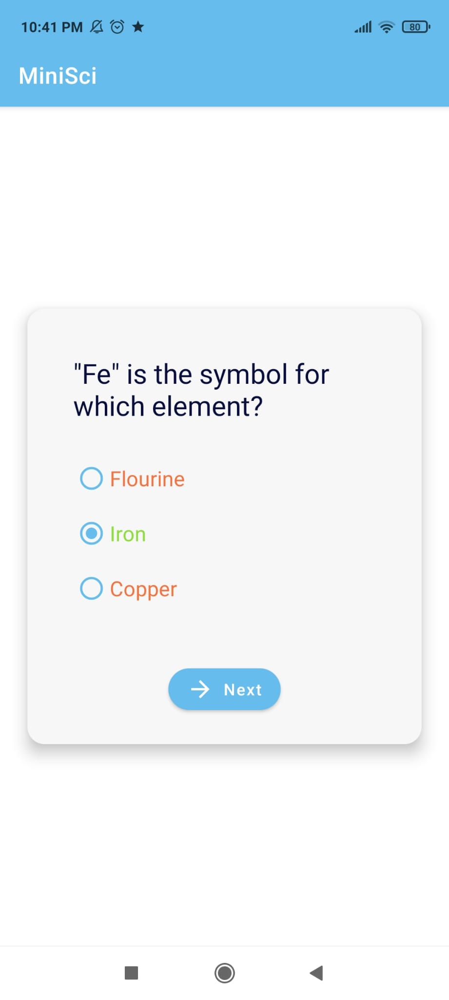
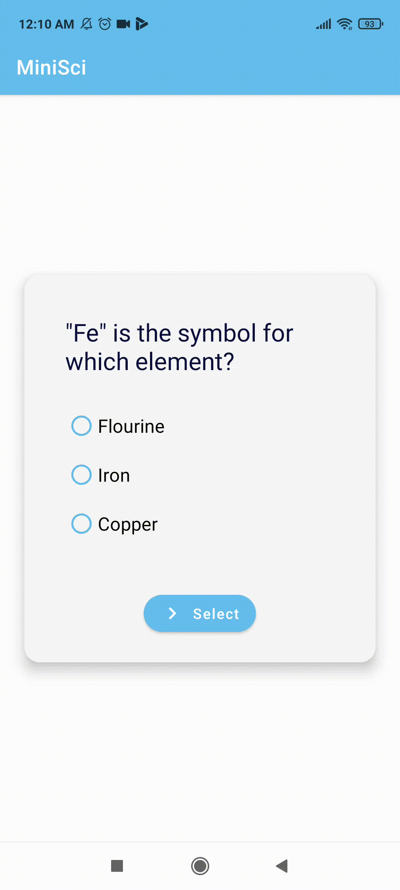

## 📚 Info Activity
- An info is feteched from Firebase and shown in a sweet (🤭) interface
- Every 2 hours an info is shown as a notification

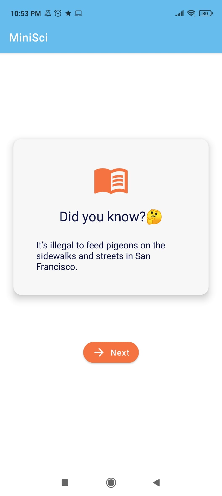
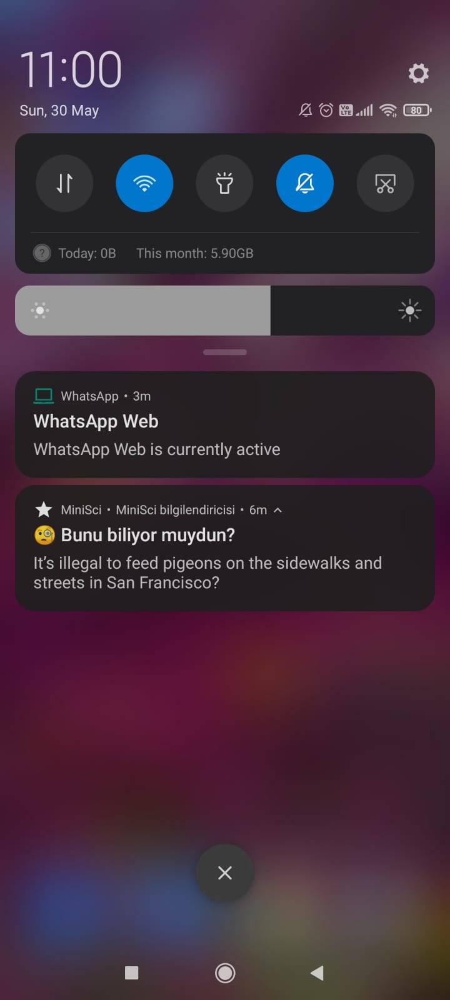

## 🥰 Quote Activity
- "Educating the mind without educating the heart is no education at all"
- A quote is feteched from Firebase and shown in an interface
- MinSci aims to educate children both scitifically and emotionaly so in this interface we aim to inspire the child and motivate him to be a better **HUMAN**

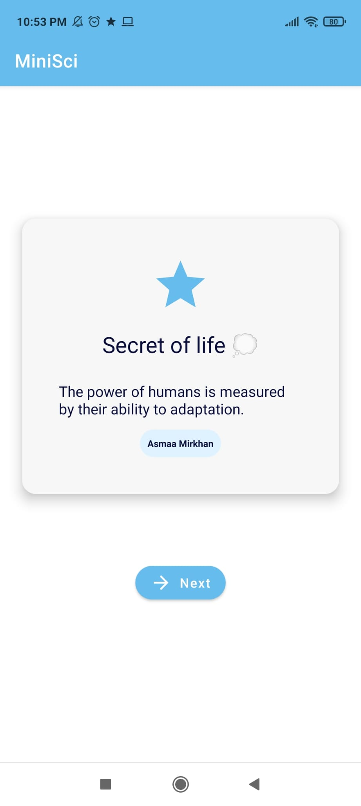

## 👩‍🎨 Logo 

- 🔵: `#66bded`
- 🟢: `#8fdd3c`
- 🟠: `#f47340`
- ⚪️: `#f7f7f7`

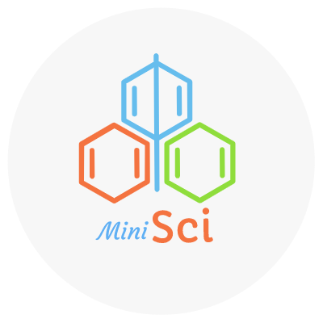

## 🚩 Note 
80% of codes are written in 20 days so code structures aren't well optimized 🤸‍♀️

## 👜 Contact
Find me on [LinkedIn](https://www.linkedin.com/in/asmaamirkhan/) and feel free to mail me, [Asmaa](mailto:asmaamirkhan.am@gmail.com) 🦋 and don't forget to take a look at [asmaamir.com 🥰](https://asmaamir.com/)

